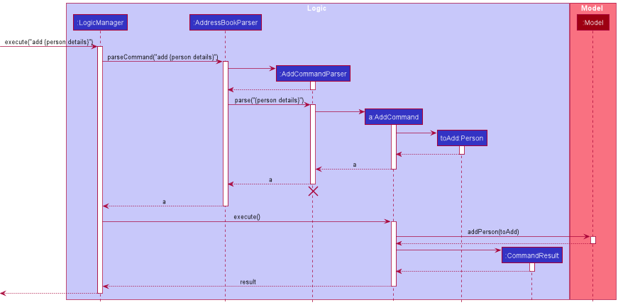
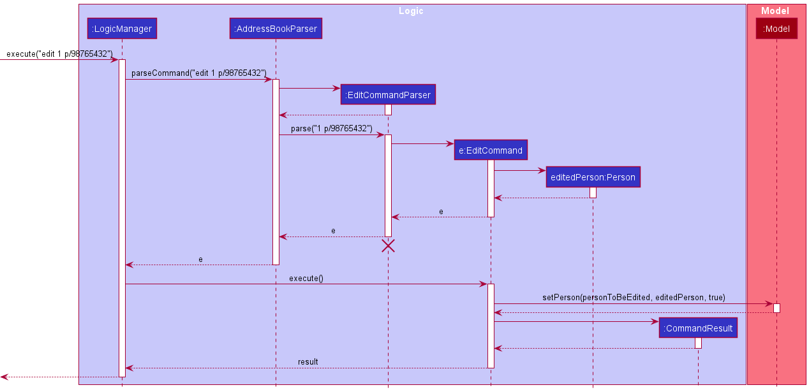
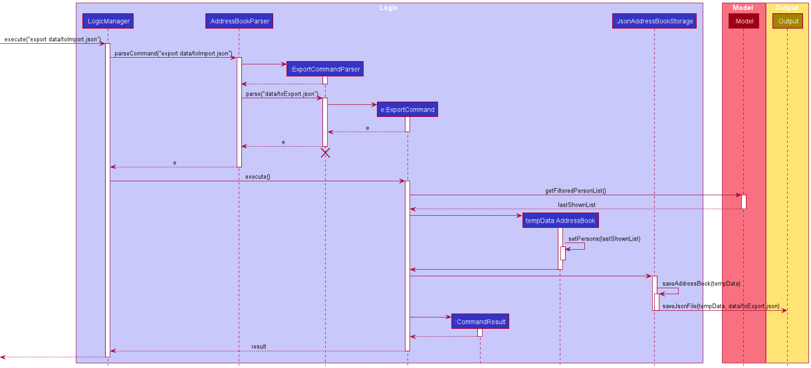
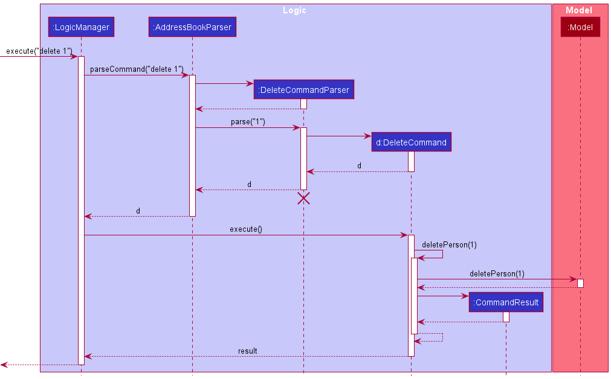
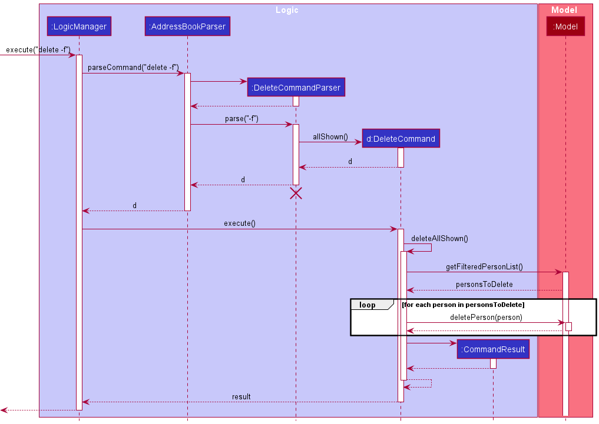
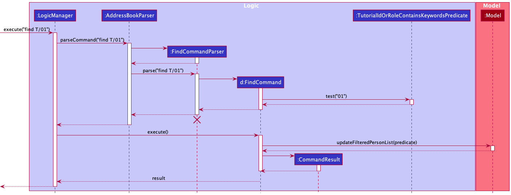
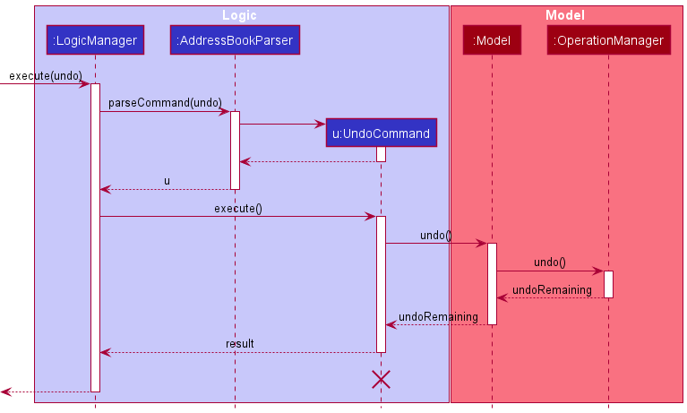

* Table of Contents
{:toc}

--------------------------------------------------------------------------------------------------------------------

## **Acknowledgements**

* {list here sources of all reused/adapted ideas, code, documentation, and third-party libraries -- include links to the original source as well}

--------------------------------------------------------------------------------------------------------------------

## **Setting up, getting started**

Refer to the guide [_Setting up and getting started_](SettingUp.md).

--------------------------------------------------------------------------------------------------------------------

## **Design**

:bulb: **Tip:** The `.puml` files used to create diagrams in this document can be found in the [diagrams](https://github.com/se-edu/addressbook-level3/tree/master/docs/diagrams/) folder. Refer to the [_PlantUML Tutorial_ at se-edu/guides](https://se-education.org/guides/tutorials/plantUml.html) to learn how to create and edit diagrams.

### Architecture

The ***Architecture Diagram*** given above explains the high-level design of the App.

Given below is a quick overview of main components and how they interact with each other.

**Main components of the architecture**

**`Main`** has two classes called [`Main`](https://github.com/se-edu/addressbook-level3/tree/master/src/main/java/seedu/address/Main.java) and [`MainApp`](https://github.com/se-edu/addressbook-level3/tree/master/src/main/java/seedu/address/MainApp.java). It is responsible for,
* At app launch: Initializes the components in the correct sequence, and connects them up with each other.
* At shut down: Shuts down the components and invokes cleanup methods where necessary.

[**`Commons`**](#common-classes) represents a collection of classes used by multiple other components.

The rest of the App consists of four components.

* [**`UI`**](#ui-component): The UI of the App.
* [**`Logic`**](#logic-component): The command executor.
* [**`Model`**](#model-component): Holds the data of the App in memory.
* [**`Storage`**](#storage-component): Reads data from, and writes data to, the hard disk.

**How the architecture components interact with each other**

The *Sequence Diagram* below shows how the components interact with each other for the scenario where the user issues the command `delete 1`.

Each of the four main components (also shown in the diagram above),

* defines its *API* in an `interface` with the same name as the Component.
* implements its functionality using a concrete `{Component Name}Manager` class (which follows the corresponding API `interface` mentioned in the previous point.

For example, the `Logic` component defines its API in the `Logic.java` interface and implements its functionality using the `LogicManager.java` class which follows the `Logic` interface. Other components interact with a given component through its interface rather than the concrete class (reason: to prevent outside component's being coupled to the implementation of a component), as illustrated in the (partial) class diagram below.

The sections below give more details of each component.

### UI component

The **API** of this component is specified in [`Ui.java`](https://github.com/se-edu/addressbook-level3/tree/master/src/main/java/seedu/address/ui/Ui.java)

The UI consists of a `MainWindow` that is made up of parts e.g.`CommandBox`, `ResultDisplay`, `PersonListPanel`, `StatusBarFooter` etc. All these, including the `MainWindow`, inherit from the abstract `UiPart` class which captures the commonalities between classes that represent parts of the visible GUI.

The `UI` component uses the JavaFx UI framework. The layout of these UI parts are defined in matching `.fxml` files that are in the `src/main/resources/view` folder. For example, the layout of the [`MainWindow`](https://github.com/se-edu/addressbook-level3/tree/master/src/main/java/seedu/address/ui/MainWindow.java) is specified in [`MainWindow.fxml`](https://github.com/se-edu/addressbook-level3/tree/master/src/main/resources/view/MainWindow.fxml)

The `UI` component,

* executes user commands using the `Logic` component.
* listens for changes to `Model` data so that the UI can be updated with the modified data.
* keeps a reference to the `Logic` component, because the `UI` relies on the `Logic` to execute commands.
* depends on some classes in the `Model` component, as it displays `Person` object residing in the `Model`.

### Logic component

**API** : [`Logic.java`](https://github.com/se-edu/addressbook-level3/tree/master/src/main/java/seedu/address/logic/Logic.java)

Here's a (partial) class diagram of the `Logic` component:

How the `Logic` component works:
1. When `Logic` is called upon to execute a command, it uses the `AddressBookParser` class to parse the user command.
1. This results in a `Command` object (more precisely, an object of one of its subclasses e.g., `AddCommand`) which is executed by the `LogicManager`.
1. The command can communicate with the `Model` when it is executed (e.g. to add a person).
1. The result of the command execution is encapsulated as a `CommandResult` object which is returned back from `Logic`.

The Sequence Diagram below illustrates the interactions within the `Logic` component for the `execute("delete 1")` API call.

:information_source: **Note:** The lifeline for `DeleteCommandParser` should end at the destroy marker (X) but due to a limitation of PlantUML, the lifeline reaches the end of diagram.

Here are the other classes in `Logic` (omitted from the class diagram above) that are used for parsing a user command:

How the parsing works:
* When called upon to parse a user command, the `AddressBookParser` class creates an `XYZCommandParser` (`XYZ` is a placeholder for the specific command name e.g., `AddCommandParser`) which uses the other classes shown above to parse the user command and create a `XYZCommand` object (e.g., `AddCommand`) which the `AddressBookParser` returns back as a `Command` object.
* All `XYZCommandParser` classes (e.g., `AddCommandParser`, `DeleteCommandParser`, ...) inherit from the `Parser` interface so that they can be treated similarly where possible e.g, during testing.

### Model component
**API** : [`Model.java`](https://github.com/se-edu/addressbook-level3/tree/master/src/main/java/seedu/address/model/Model.java)

The `Model` component,

* stores the address book data i.e., all `Person` objects (which are contained in a `UniquePersonList` object).
* stores the currently 'selected' `Person` objects (e.g., results of a search query) as a separate _filtered_ list which is exposed to outsiders as an unmodifiable `ObservableList<Person>` that can be 'observed' e.g. the UI can be bound to this list so that the UI automatically updates when the data in the list change.
* stores a `UserPref` object that represents the user’s preferences. This is exposed to the outside as a `ReadOnlyUserPref` objects.
* does not depend on any of the other three components (as the `Model` represents data entities of the domain, they should make sense on their own without depending on other components)

:information_source: **Note:** An alternative (arguably, a more OOP) model is given below. It has a `Tag` list in the `AddressBook`, which `Person` references. This allows `AddressBook` to only require one `Tag` object per unique tag, instead of each `Person` needing their own `Tag` objects. 

### Storage component

**API** : [`Storage.java`](https://github.com/se-edu/addressbook-level3/tree/master/src/main/java/seedu/address/storage/Storage.java)

The `Storage` component,
* can save both address book data and user preference data in json format, and read them back into corresponding objects.
* inherits from both `AddressBookStorage` and `UserPrefStorage`, which means it can be treated as either one (if only the functionality of only one is needed).
* depends on some classes in the `Model` component (because the `Storage` component's job is to save/retrieve objects that belong to the `Model`)

### Common classes

Classes used by multiple components are in the `seedu.addressbook.commons` package.

--------------------------------------------------------------------------------------------------------------------

## **Implementation**

### Data Archiving Features
#### Add feature

The add feature is facilitated by `AddCommand`. It extends `Command` with a person as parameter where the person to be added is stored internally as a `toAdd`. The add mechanism relies on `ModelManager#addPerson()` to add the Person to be added to the `personList` in `ModelManager`.

The following sequence diagram shows how the add operation works. For simplicity the command `add n/John Doe p/98765432 a/311, Clementi Ave 2, #02-25 t/friends t/owesMoney g/john-doe N/e0123456 r/student s/A0123456X T/11` is simplified to `add {person details}`

#### Edit feature

The edit feature is facilitated by `EditCommand`. It extends `Command` with an Index and EditPersonDescriptor as parameter where the person to be edited is stored at index in the `personList` and EditPersonDescriptor stored the details of the edited fields. The edit mechanism relies on `ModelManager#setPerson()` to edit the Person in the `personList` in `ModelManager`.

The following sequence diagram shows how the edit operation works.

#### Bulk Tag feature

The bulk tag feature is facilitated by `BulkTagCommand`. It extends `Command` with a Tag as a parameter. The addition of the Tag relies on `ModelManager#setPerson()` to edit the Person in the `personList` in `ModelManager` by specifically adding the given Tag to the person.
One important consideration for the command is that the bulk tag command does not affect the existing tags and thus functions differently as compared to the edit command.

#### Import feature

The import feature is facilitated by `ImportCommand`. It extends `Command` with a file path where the targeted import file is stored, stored internally as a `filePath`. It also overwrites the `execute` function to import the json file from the file path stored.

This operation is exposed in the `Model` interface as `Model#importFile(Path filePath)`. This is further facilitated by an additional function in `AddressBook`, `AddressBook#mergeFile`.

The following sequence diagram shows how the import operation works:

#### Export feature

The export feature is facilitated by `ExportCommand`. It extends `Command` with a filepath where the exported contact list should be stored, stored internally as a `filePath`. It also overwrites the `execute` function to export the last searched contact list to a json file in the file path stored.

The following sequence diagram shows how the export operation works:

#### ExportEmail feature

The export feature is facilitated by `ExportEmailCommand`. It extends `Command` with a filepath where the exported contact list should be stored, stored internally as a `filePath`. It also overwrites the `execute` function to export the last searched contact list to a list of emails in the file path stored.

The following sequence diagram shows how the export operation works:

### Address Book Management

#### Delete feature

The `delete` mechanism relies on `ModelManager#deletePerson()`. The Person(s) to be deleted is obtained through `ModelManager#getFilteredPersonList()`

Below is a sequence diagram for deleting a Person from the address book, executed after the user inputs `delete 1`

`DeleteCommand` also exposes 2 factory methods:
- `DeleteCommand#allShown()` returns a `DeleteCommand` which deletes all Persons shown in the main window.
- `DeleteCommand#all()` which deletes all Persons in the address book.

Below is a sequence diagram for the deleting all shown Persons executed after the user inputs `delete -f` or `delete -a -f`. `DeleteCommand` iterates through the list returned by `Model#getFilteredPersonList()` to delete all Persons shown in the main window.

The `DeleteCommand` returned by `DeleteCommand#all()` uses `AddressBook#resetData()` exposed in the `Model` interface as `Model#setAddressBook()` to clear the address book by passing in an empty `AddressBook`.

#### Sort Feature

The sort feature is facilitated by `SortCommand`. It extends `Command` with a `Prefix` which specifies the prefix the `AddressBook` is to be sorted by, as well as a boolean `reverse` which specifies the order of the sorted list.
This method is exposed in the `Model` interface as `Model#sortAddressBook()` This is further facilitated by  `AddressBook`, `AddressBook#sortList()`, a `PersonComparator` and a `Person#compare(Person p, Prefix prefix)` method to allow for sorting of the list by the `Prefix` specified.

##### Design Considerations

**Aspect: How sort executes:**

* **Alternative 1 (current choice):** Sorts the list saved inside the `Model`'s `AddressBook`.
    * Pros: Easy to implement.
    * Cons: Users might just want a temporary sorting of the list and not a permanent sorting.

* **Alternative 2:** Sorts the `filteredPersons` list shown by the `Model`.
    * Pros: Allow users to have a temporary sorting of the list, which they can later export if they want to be permanent.
    * Cons: Difficult to implement, as the `FilteredList` data structure used by `filteredPersons` cannot be mutated.

#### Statistic Feature
The statistic feature is facilitated by `StatCommand`. It overwrites the `execute` function to get a count of the various tags, types and tutorial ID of the last searched contact list.

The following sequence diagram shows how the statistic operation works:

### Search features

#### Find feature

The find feature is facilitated by `FindCommand`. It extends `Command` with a type to be searched, as well as the key to be searched. This feature uses `AttributeContainsKeywordsPredicate#test(Person)` and the person to be searched is obtained using `ModelManager#getFilteredPersonList()`. If a search using a partial match can be done, the feature also uses `AttributeContainsKeywordsPredicate#testByType(Person, String)`.

The following sequence diagram shows how the find operation works for a name:

The following sequence diagram shows how the find operation works for a Tutorial ID:

### Undo and Redo Features

The undo/redo mechanism is facilitated by `OperationManager`, which stores 2 stacks of `Operation`, one for `redo` (`redoStack`) and one for `undo` (`undoStack`).

Each `Operation` stores a `ModelManagerState` which encapsulates the state of `ModelManager` by storing `AddressBook`, `UserPrefs`, and `Predicate<Person>`.

`OperationManager` exposes the following methods:
* `OperationManager#run()` — Saves the current model manager state to history then runs an operation.
* `OperationManager#undo()` — Restores the previous model manager state from its history.
* `OperationManager#redo()` — Redoes the last undone operation.

The following sequence diagram shows how the undo operation works:

:information_source: **Note:** The lifeline for `UndoCommand` should end at the destroy marker (X) but due to a limitation of PlantUML, the lifeline reaches the end of diagram.

`OperationManager#undo()` pops an `Operation` from `undoStack`, then pushes it to the `redoStack`.

`OperationManager#redo()` pops an `Operation` from `redoStack`, then pushes it to the `undoStack`.

`OperationManager#run()` clears `redoStack` as any remaining redoes are invalidated by the last run command. 

--------------------------------------------------------------------------------------------------------------------

## **Documentation, logging, testing, configuration, dev-ops**

* [Documentation guide](Documentation.md)
* [Testing guide](Testing.md)
* [Logging guide](Logging.md)
* [Configuration guide](Configuration.md)
* [DevOps guide](DevOps.md)

--------------------------------------------------------------------------------------------------------------------

## **Appendix: Requirements**

### Product scope

**Target user profile**:

* instructor from cs2103
* has a need to manage a significant number of contacts of students and tutors
* prefer desktop apps over other types
* can type fast
* prefers typing to mouse interactions
* is reasonably comfortable using CLI apps

**Value proposition**: manage contacts faster than a typical mouse/GUI driven app

### User stories

Priorities: High (must have) - `* * *`, Medium (nice to have) - `* *`, Low (unlikely to have) - `*`

| Priority | As a …​                                    | I want to …​                            | So that I can…​                                                                  |
| -------- | ------------------------------------------ | ------------------------------                | ----------------------------------------------------------------------              |
| `* * *`  | potential user                             | find a user guide for the app                 | have an idea of the features provided by the app                                    |
| `* * *`  | beginner user                              | add a new person                              | keep track of all my students and TAs                                               |
| `* * *`  | beginner user                              | edit a person                                 | change any incorrect data and remove specific tags when needed                      |
| `* * *`  | Professor                                  | tag contacts                                  | keep track of Lecture/Tutorial groups that different contacts belong to             |
| `* * *`  | beginner user                              | see all the contacts I have at once           | easily tell who I have added and who I have not                                     |
| `* * *`  | impatient user                             | import my existing contacts from a json file  | start using ProfBook without manually inputting every piece of information          |
| `* * *`  | cautious user                              | export my existing contacts to a json file    | move my address book or keep a backup                                               |
| `* * *`  | beginner user                              | save the data to a json document              | update it manually and have the option to close the program and open it again later |
| `* * *`  | organised user                             | delete a specific contact with a specific detail | remove entries that I no longer need                                             |
| `* * *`  | beginner user                              | exit the program when I am done               | I don't have to keep it running all the time                                        |
| `* * *`  | intermediate user                          | search a person with any specific detail      | locate details of persons without having to go through the entire list              |
| `* * *`  | intermediate user                          | search a person with the given tag            | view all the contacts with the given tag                                            |
| `* *`    | beginner user                              | find the user guide for the app on the app    | have an idea of the features of the app without having to leave the app             |
| `* *`    | beginner user                              | export search the set of contacts with the given tag | locate a person easily                                                       |
| `* *`    | user in a supervising position             | export name and email to a file               | send specific emails to a select few contacts
| `* *`    | curious user                               | view statistics about the contacts that I have added | derive more information about my contacts
| `* *`    | Professor                                  | bulk tag contacts                             | I can quickly tag TAs and Students according to their groups

### Use cases

(For all use cases below, the **System** is the `ProfBook` and the **Actor** is the `user`, unless specified otherwise)

**Use case: Delete a person**

**MSS**

1.  User requests to list/search persons
2.  ProfBook shows a list of persons
3.  User requests to delete a specific person in the list
4.  ProfBook deletes the person

    Use case ends.

**Extensions**

* 2a. The list is empty.

  Use case ends.

* 3a. The given index is invalid.

    * 3a1. ProfBook shows an error message.

      Use case resumes at step 2.

**Use case: Add a person**

**MSS**

1. User requests to add a person
2. ProfBook checks if input is valid
3. ProfBook adds the persons

    Use case ends.

**Extensions**

* 2a. Arguments that should be there is not there
  * 2a1. ProfBook rejects the command and shows an error message.

    Use case ends.

* 2b. Arguments that are added results in a person that already exists in the ProfBook.
    * 2b1. ProfBook rejects the command and shows an error message.

      Use case ends.
    
**Use case: Edit a contact**

**MSS**

1. User requests to list/search persons
2. ProfBook shows a list of persons
3. User requests to edit a specific person in the list
4. ProfBook checks if input is valid
5. ProfBook edits the person

    Use case ends.

**Extensions**

* 2a. The list is empty.

  Use case ends.

* 4a. The given index is invalid.
  * 4a1. AddressBook shows an error message.

  Use case resumes at step 2.

* 4b. The attribute to be edited does not exist.
  * 4b1. ProfBook shows an error message.
  Use case ends

* 4c. If the attribute edited is the name and results in a similar person i.e. same name as another person
  * 4c1. ProfBook shows an error message.

      Use case ends

* 4d. If the attribute edited is in the invalid format
    * 4d1. ProfBook shows an error message.

      Use case ends

**Use case: Export contacts**

**MSS**

1.  User requests to list/search persons
2.  AddressBook shows a list of persons
3.  User requests to export the list
4.  AddressBook exports list to JSON file

    Use case ends.

**Extensions**

* 3a. The file directory is invalid

    * 3a1. AddressBook shows an error message.

      Use case resumes at step 2.

**Use case: Export emails of contacts**

**MSS**

1.  User requests to list/search persons
2.  AddressBook shows a list of persons
3.  User requests to export the emails of the list
4.  AddressBook exports list of emails to JSON file

    Use case ends.

**Extensions**

* 3a. The file directory is invalid

    * 3a1. AddressBook shows an error message.

      Use case resumes at step 2.

**Use case: Import existing contacts**

**MSS**

1. User requests to import existing contacts from JSON file.
2. AddressBook checks if file is valid format
3. AddressBook shows a list of persons
4. User decides to import (or not)
5. AddressBook imports if user selects yes

    Use case ends.

**Extensions**

* 2a. The list is empty.

  Use case ends.

* 3a. The file is in invalid format/does not exist

    * 3a1. AddressBook shows an error message.

      Use case ends.

**Use case: Bulk Tag a person**

**MSS**

1. User requests to bulk tag the filtered person list
2. ProfBook checks if input is valid
3. ProfBook adds the tag to all the persons in the filtered person list

   Use case ends.

**Extensions**

* 2a. Tag to be added is invalid
    * 2a1. ProfBook rejects the command and shows an error message.

      Use case ends.

* 2b. The filtered list is empty
    * 2b1. ProfBook runs the command but it has no effect.

      Use case ends.
    
### Non-Functional Requirements

1. Should work on any _mainstream OS_ as long as it has Java `11` or above installed.
2. Should be able to hold up to 1000 persons without a noticeable sluggishness in performance for typical usage.
3. A user with above average typing speed for regular English text (i.e. not code, not system admin commands) should be able to accomplish most of the tasks faster using commands than using the mouse.
4. The system should be usable by a novice who has never used any similar application.
5. The project is expected to adhere to a schedule that delivers a new version every 2 weeks.

### Glossary

* **Mainstream OS**: Windows, Linux, Unix, OS-X
* **Private contact detail**: A contact detail that is not meant to be shared with others
* **Person**: A single contact in the address book. An individual can be represented by multiple Persons if they are added multiple times.
* **Tag**: A text string associated with a person. A person can have multiple tags, and a tag can be added to multiple persons.

--------------------------------------------------------------------------------------------------------------------

## **Appendix: Instructions for manual testing**

Given below are instructions to test the app manually.

:information_source: **Note:** These instructions only provide a starting point for testers to work on;
testers are expected to do more *exploratory* testing.

### Launch and shutdown

1. Initial launch

   1. Download the jar file and copy into an empty folder

   1. Double-click the jar file Expected: Shows the GUI with a set of sample contacts. The window size may not be optimum.

1. Saving window preferences

   1. Resize the window to an optimum size. Move the window to a different location. Close the window.

   1. Re-launch the app by double-clicking the jar file. 
       Expected: The most recent window size and location is retained.

### Deleting a person

1. Deleting a person while all persons are being shown

   1. Prerequisites: List all persons using the `list` command. Multiple persons in the list.

   1. Test case: `delete 1` 
      Expected: First contact is deleted from the list. Details of the deleted contact shown in the status message. Timestamp in the status bar is updated.

   1. Test case: `delete 0` 
      Expected: No person is deleted. Error details shown in the status message. Status bar remains the same.

   1. Other incorrect delete commands to try: `delete`, `delete x`, `...` (where x is larger than the list size) 
      Expected: Similar to previous.

### Sort Test
1. Test case: `sort` 
   Expected: List is sorted by name.
2. Test case: `sort -r` 
   Expected: List is sorted by name in reverse.
3. Test case: `sort \T` 
   Expected: List is sorted by TutorialID
4. Test case: `sort \a` 
   Expected: No change to list. Error details shown in status message.

### Add Test
1. Test case: `add n/John Doe p/98765432 a/311, Clementi Ave 2, #02-25 t/friends t/owesMoney g/john-doe N/e0123456 r/student s/A0123456X T/11 `
  Expected: Adds the person to the ProfBook. 
  Now progressively remove or edit each attribute in the add command and view the outputs
2. Test case: Calling the same command `add n/John Doe p/98765432 a/311, Clementi Ave 2, #02-25 t/friends t/owesMoney g/john-doe N/e0123456 r/student s/A0123456X T/11 `
  Expected: This person already exists in the address book.
3. Test case: On changing name to lower case we can add the person `add n/john doe p/98765432 a/311, Clementi Ave 2, #02-25 t/friends t/owesMoney g/john-doe N/e0123456 r/student s/A0123456X T/11 `
  Expected: Adds the person to the ProfBook.
4. Test case: `add n/John Doe a/311, Clementi Ave 2, #02-25 t/friends t/owesMoney g/john-doe N/e0123456 r/student s/A0123456X T/11 `
  Expected: Invalid command format!

### Edit Test
1. Test case: `edit 1 n/John Doe`
 Expected: Edits the person at index 1 and changes name to John Doe.
2. Test case: On changing index to 2 and running the command `edit 2 n/John Doe`
  Expected: This person already exists in the address book.
 Now progressively replace or add more attribute in the edit command and view the outputs
3. Test case: `edit 1 N/e0000000`
  Expected: Edits the person at index 1 and changes NUSNET_ID to E0000000 and Email to e0000000@u.nus.edu.

### Bulk Tag Test
1. Test case: `bulk_tag t/friends`
    Expected: Added the Tags [friends] to the Persons
2. Test case: `bulk_tag t/friends`
     Expected: Added the Tags [friends] to the Persons. No change since all persons have the tag `friends`
2. Test case: `bulk_tag t/friends t/passed`
     Expected: Added the Tags [passed] [friends] to the Persons. Now tag `passed` is added to all the person and `friends` already existed for all the persons
   
### Import and Export

1. Exporting then importing back original list of contacts

    1. Prerequisites: List all persons using the `list` command. Multiple persons in the list.

    2. Test case: `export currList.json` 
       Expected: The current contact list is exported to the file currList.json
    
       1. Test case: `edit 0 n/Amanda` 
       Expected: First contact name is updated to Amanda
       
       2. Test case: `import currList.json` 
       Expected: The previous unedited old contact will be added into the current contact list
       
    3. Other incorrect delete commands to try: `import`, `export`  
       Expected: Error details shown in the status message.

2. Export last searched list of contacts

   1. Prerequisites: Search a group of contacts using the find command such as `find t/friends` command. Multiple persons in the list.

   1. Test case: `export friends.json` 
      Expected: Last searched contacts are exported to json file, friends.json

### Export emails of last searched list of contacts

1. Export emails of all persons are being shown

    1. Prerequisites: List all persons using the `list` command. Multiple persons in the list.

    1. Test case: `exportemail emails.txt` 
       Expected: Emails of all contacts are exported to emails.txt

    1. Other incorrect delete commands to try: `exportemail`  
       Expected: Error details shown in the status message.

1. Export emails of last searched list of contacts

    1. Prerequisites: Search a group of contacts using the find command such as `find t/friends` command. Multiple persons in the list.

    1. Test case: `exportemail friends.txt` 
       Expected: Emails of last searched contacts are exported to emails.txt

### Get Statistics of last searched list of contacts

1. Show statistics of all persons are being shown

    1. Prerequisites: List all persons using the `list` command. Multiple persons in the list.

    1. Test case: `stat` 
       Expected: Tag, Type and Tutorial count of all the contacts are shown in the display

1. Show statistics of last searched list of contacts

    1. Prerequisites: Search a group of contacts using the find command such as `find t/friends` command. Multiple persons in the list.

    1. Test case: `stat` 
       Expected: Tag, Type and Tutorial count of the last searched list of contacts are shown in the display

### Saving data

1. Dealing with missing/corrupted data files

   1. _{explain how to simulate a missing/corrupted file, and the expected behavior}_
   

## Effort
The difficulty level for our project is at a relatively moderate level. 
We did not make large changes to the AB3 but instead chose to enhance the existing features. Most of the challenges faced were from figuring out what could be changed in the AB3 functions and what could not. For example, when implementing the sort feature, there were so many different lists in AB3 and some of them were immutable. So we had to do alot of testing to figure out which lists were mutable and the effects of mutating these lists on the app.
